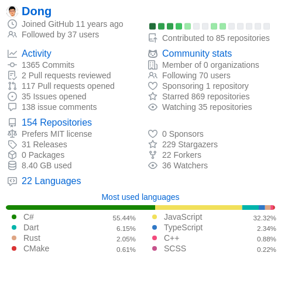



## About Me

- **Core expertise:** .NET / C#, Flutter, TypeScript, Python
- **Platforms:** Windows · macOS · Linux · iOS · Android · Web
- **DevOps:** GitHub · Azure · Docker · CloudFlare · Vercle · Supabase

## GitHub Stats

## Tech Stack

## Featured Repositories

<table>
  <tr>
    <td></td>
    <td></td>
  </tr>
  <tr>
    <td></td>
  </tr>
</table>

*Open to interesting projects and collaborations — feel free to reach out!*

